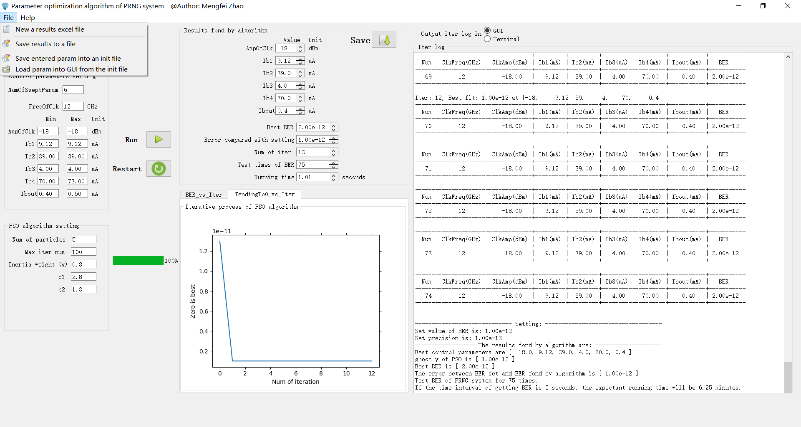

# Multicurrent10控制软件介绍

[TOC]

## 文档信息

撰写日期：2021.07.24

版本：v1.0

## 工程文件介绍

**文件夹介绍：**

* doc：存放工程的帮助、说明文档
* icon：存放GUI中用到的icon
* param_init：存放GUI中的要加载的初始化数据
* results：存放GUI中的要加载的初始化数据，保存的BER等结果数据

**文件介绍：**

* .gitignore：用于Git的设置文件
* algorithmCtrl.code-workspace ：vscode的工作空间文件
* base.py：pso算法内核相关的文件
* figure_canvas.py：GUI中画图相关的文件
* icons.qrc，icons_rc.py ：GUI中的icons处理的相关文件
* **main.py**：主程序的入口文件
* operateExcelFile.py：操作excel的文件
* operateFile.py：操作一般性文件的模块
* PSO.py：pso算法的内核文件
* test_**.py ：测试文件
* toos.py：存放一些小的工具性的函数
* Ui_win.py：win.ui转换后的py文件
* win.ui：GUI界面文件，可以用qtdesigner打开
* gui_**.py：将MyMainWin类中的一些method重构到了这几个分立的类中，然后在MyMainWin类中对几个分类继承

## GUI界面介绍

**GUI大致介绍：**

一共分为3块区域，最左边是参数设置区域；中间是结果区域；最右边是Iter log区域。

**文件选项卡介绍：**

* New a results excel file：会在results文件夹下新建一个带有标题栏的excel文件
* Save results to a file：将结果存入到一个excel文件中
* Save entered param into an init file：将左侧输入的参数存入到一个初始化Init文件中
* Load param into GUI from the init file：将初始化参数从文件中加载到GUI中

**Help选项卡介绍：**

* documentation：查看帮助文档，即此文件

**按钮介绍：**

* Run：点击会运行算法
* Restart：点击会关闭GUI，再重新打开
* Save：点击保存数据

