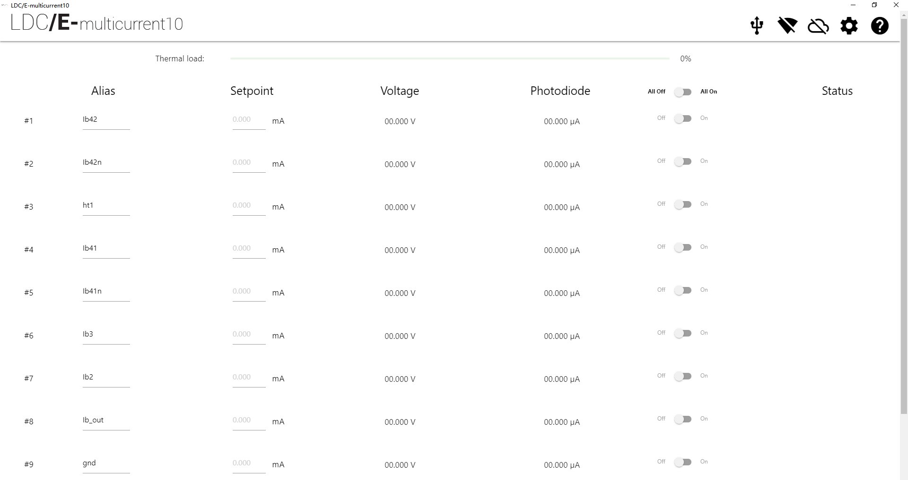
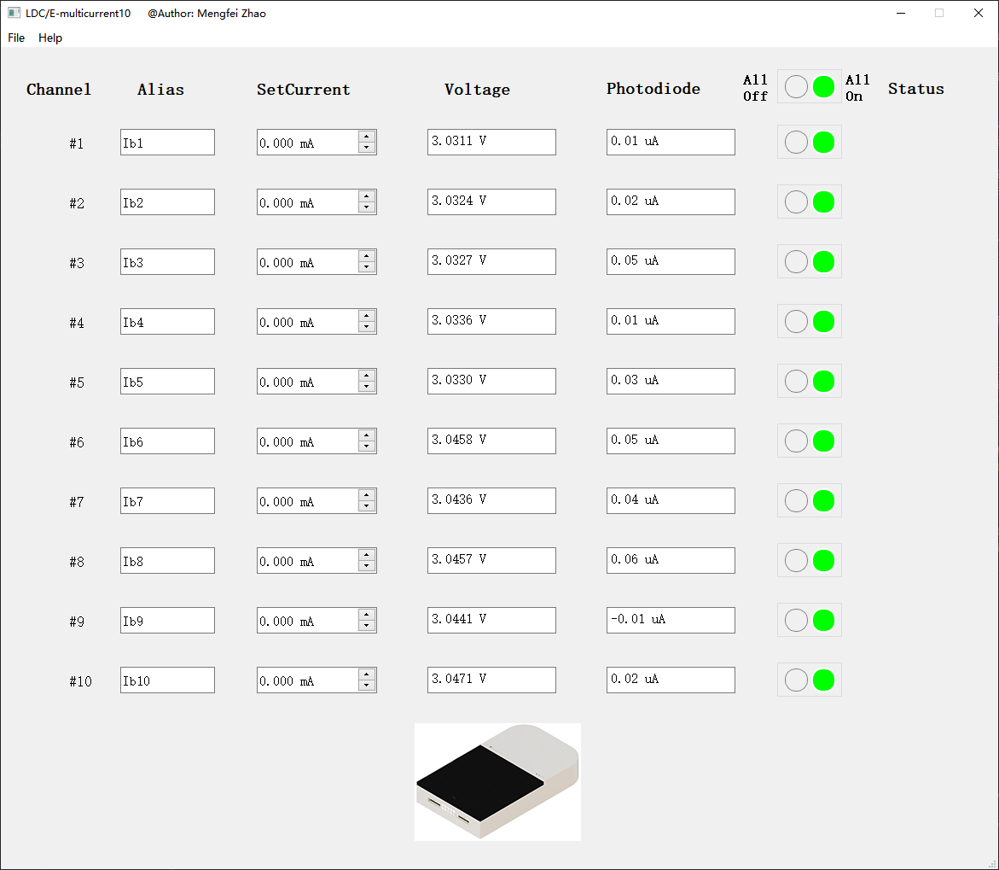
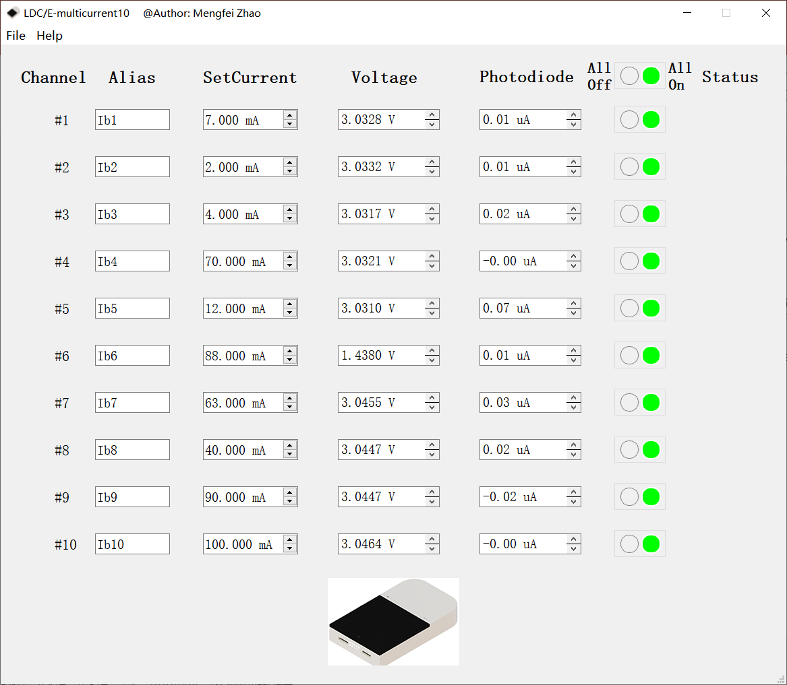
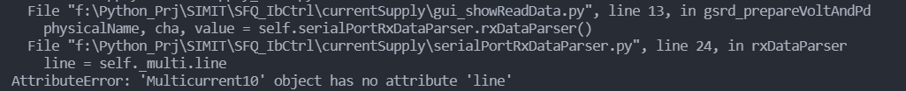

# Multicurrent10控制软件介绍

[TOC]

## 文档信息

撰写日期：2021.07.24

版本：v1.0

## 工程介绍

* python：3.8.5-64bit

**文件夹介绍：**

* doc：存放工程的帮助、说明文档
  * documentation.md 本文档
  * Doc_of_multicurrent10_class.txt 官方提供的类说明文档
* icon：存放GUI中用到的icons
* results：存放GUI中的要加载的初始化数据，保存的结果数据

**文件介绍：**

* **Run.bat: 点击此文件，会自动运行程序**

* .gitignore：用于Git的设置文件
* constants.py：一些常数设置
* **currentSupply_main.py：主程序**
* gui_**.py：将MyMainWin类中的一些method重构到了这几个分立的类中，然后在MyMainWin类中对几个分类继承
* icons.qrc，icons_rc.py ：GUI中的icons处理的相关文件

* LDCEmulticurrent10.code-workspace ：vscode的工作空间文件
* multicurrent10.py：电流源设备的驱动类（官方给出的）
* operateExcelFile.py：操作excel的文件
* operateFile.py：操作一般性文件的模块
* Ui_win.py：win.ui转换后的py文件
* win.ui：GUI界面文件，可以用qtdesigner打开

## GUI界面介绍

**官方给出的软件截图：**

**本程序的软件截图：**

**GUI大致介绍：**

总开关可以同时控制所有channels的开关。在SetCurrent中，输入电流值，回车，电流即会加载到设备中。该软件基本上可以实现对该电流源的控制和显示，并且给用户提供了控制程序接口，用户可以根据自己需求来集成到自己的应用中。Status中的红色radioButton作为LED指示灯，目前还没有开发这个功能。

**文件选项卡介绍：**

* Save entered param into an init file：将界面中的所有参数（包括读取到的Voltage和Photodiode）存入到一个初始化Init文件中
* Load param into GUI from the init file：将初始化参数从文件中加载到GUI中

**Setting选项卡介绍：**

* Set max current for channels：为每一个通道设置最大电流值

**Help选项卡介绍：**

* documentation：查看帮助文档，即此文件

## 实际测试

当设置上面这些电流参数时，用精密电流表测试对应通道的输出电流，工作正常。

## 问题记录

* 若出现下面的报错，这是因为上一次不正常的退出程序导致的，此时将设备重新上电，再次运行程序即可。

